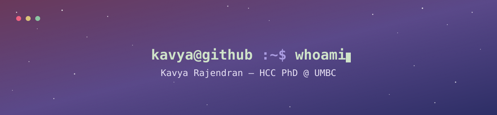

<div align="center">
  
</div>

<a href="https://www.linkedin.com/in/kavya-rajendran"></a>
<a href="https://www.behance.net/krithvi"></a>
<a href="https://twitter.com/kavyakrithvi"></a>

 
```text
role     Second-year HCC PhD Student
focus    HCI × Affective Computing × Dance Movement × Social Computing
job      Teaching Assistant - IS 303, HCC 629, HCC 741
status   Preparing for comps
summer   open to work — Summer 2027 Internships
future  UX Researcher · UI/UX Designer · Product Designer (grad/PhD intern)
```
 
[`❯ open portfolio`](https://krithvi.github.io/space-cadet/) · [`❯ open cv.pdf`](https://krithvi.github.io/krithvi/CV.pdf)

## `$ cat skills.json`
 
### design
  

### programming languages
        

### frameworks
   

### tools
    

## `$ ls currently/`
 
- 🪄 working on **UX projects**
- 🚀 re-learning **JavaScript** and **LaTeX**
- 🤔 looking for help with **CHI-Workshop Proposal Writing**


<!--
## 🎧 Now Listening to
[](https://spotify-github-profile.kittinanx.com/api/view?uid=31bni4ol6owamrrttxhwml6hkhya&redirect=true)

I used to be a <a href="https://open.spotify.com/user/31bni4ol6owamrrttxhwml6hkhya?si=603e26ce75d8426b"></a> addict 🎶 [^stats]: Github stats customisation from https://github.com/kittinan/spotify-github-profile

Next up: 

[^badge]: Markdown badges from https://github.com/Ileriayo/markdown-badges
-->
